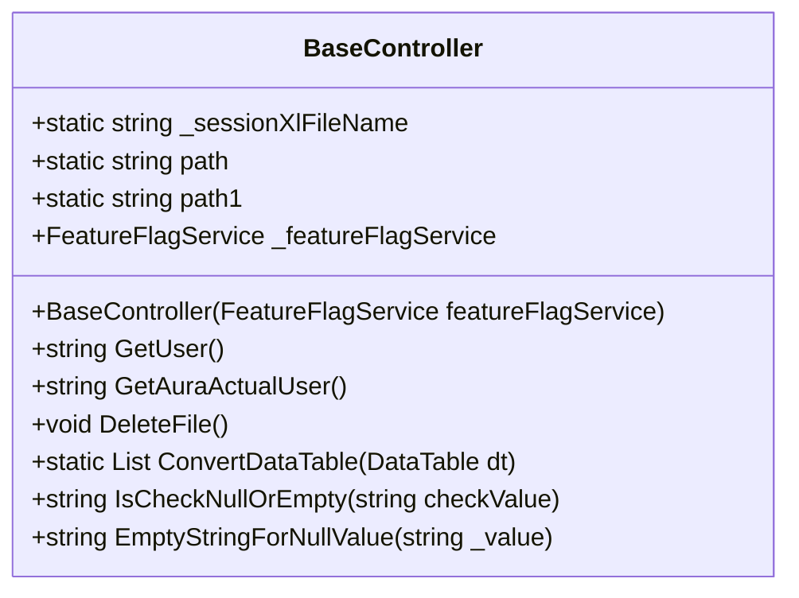

# Documentation for `BaseController.cs`

## Overview

The `BaseController` class serves as a foundational controller for the application. It inherits from `ControllerBase` and is responsible for handling common operations related to user claims, file management, and data conversion. This class is part of the `COR.Profile.Api.Controllers` namespace and is annotated with attributes to enable API routing and rate limiting.

### Class Hierarchy

## Attributes

- `[Route("[controller]")]`: Defines the route template for the controller.
- `[ApiController]`: Indicates that this controller responds to web API requests.
- `[EnableRateLimiting("fixed")]`: Enables rate limiting for the controller, controlling the number of requests that can be processed in a given time frame.

## Variables

- `public static readonly string _sessionXlFileName`: A static string that holds the filename for the session's Excel file, formatted as `yyyyMMddHHmmss.xlsx`.
- `public static readonly string path`: The path where the session Excel file will be stored.
- `public static readonly string path1`: The directory path where files will be downloaded.
- `protected readonly FeatureFlagService _featureFlagService`: An instance of `FeatureFlagService` used to manage feature flags.

## Constructor

### `BaseController(FeatureFlagService featureFlagService)`

Initializes a new instance of the `BaseController` class.

**Parameters:**
- `FeatureFlagService featureFlagService`: An instance of `FeatureFlagService` used for retrieving feature flags.

## Methods

### `GetUser() : string`

Retrieves the user ID associated with the current user. It checks the user's claims for `app_metadata`, retrieves the `cor_user_id`, and handles impersonation if applicable.

**Returns:**
- A string containing the `cor_user_id` of the user or an empty string if not found.

**Exceptions:**
- Throws a generic `Exception` if an error occurs during the execution.

### `GetAuraActualUser() : string`

Fetches the actual user ID from the user's claims, specifically from the `app_metadata`.

**Returns:**
- A string containing the `cor_user_id` of the actual user or an empty string if not found.

**Exceptions:**
- Throws a generic `Exception` if an error occurs during the execution.

### `DeleteFile() : void`

Deletes all files in the specified directory that are older than one day. If the directory does not exist, it creates it.

### `ConvertDataTable<T>(DataTable dt) : List<T>`

Converts a `DataTable` into a list of type `T`. This is a generic method that iterates through the rows of the `DataTable` and maps them to instances of `T`.

**Parameters:**
- `DataTable dt`: The `DataTable` to convert.

**Returns:**
- A list of type `T` containing the mapped data.

### `GetItem<T>(DataRow dr) : T`

A private static method that creates an instance of type `T` and populates its properties based on the values from a given `DataRow`.

**Parameters:**
- `DataRow dr`: The `DataRow` containing the data to map.

**Returns:**
- An instance of type `T` populated with data from the `DataRow`.

### `IsCheckNullOrEmpty(string checkValue) : string`

Checks if the provided string is null or empty. If so, it returns an empty string; otherwise, it returns the original string.

**Parameters:**
- `string checkValue`: The string to check.

**Returns:**
- A string, either empty or the original string.

### `EmptyStringForNullValue(string _value) : string`

Returns an empty string if the provided value is null or whitespace; otherwise, it returns the value itself.

**Parameters:**
- `string _value`: The value to check.

**Returns:**
- A string that is either empty or the original value.

## Conclusion

The `BaseController` class is designed to manage common operations in a web API context, specifically focused on user claims and file management. It provides utility methods for data conversion and ensures that user data is handled securely and efficiently. The use of feature flags allows for conditional functionality based on application settings, thus enhancing the flexibility of the application.