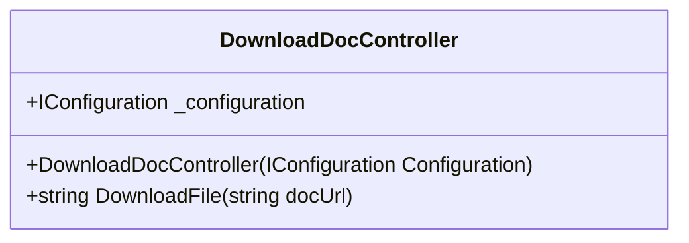

# DownloadDocController Documentation

## Overview

The `DownloadDocController` class is a controller designed for downloading documents from a specified URL and saving them as PDF files in a temporary location. It utilizes a rate-limiting policy to control the frequency of requests to the API. The class interacts with a configuration object to retrieve credentials needed for accessing a report server.

## Dependencies

- `System`
- `System.IO`
- `System.Net`
- `Microsoft.AspNetCore.Mvc`
- `Microsoft.AspNetCore.RateLimiting`
- `Microsoft.Extensions.Configuration`

## Class Hierarchy



## Attributes

### IConfiguration _configuration

- **Type**: `IConfiguration`
- **Description**: This property holds the configuration settings required for the controller, including credentials for the report server.

## Constructor

### DownloadDocController(IConfiguration Configuration)

- **Parameters**: 
  - `Configuration`: An instance of `IConfiguration` that contains settings and key-value pairs.
  
- **Description**: 
  Initializes a new instance of the `DownloadDocController` class and assigns the provided configuration to the `_configuration` property.

## Methods

### string DownloadFile(string docUrl)

- **Parameters**: 
  - `docUrl`: A `string` representing the URL of the document to be downloaded.

- **Returns**: 
  - Returns a `string` representing the path of the downloaded file.

- **Description**: 
  This method downloads a file from the specified `docUrl` and saves it to a temporary path. The file is named with a timestamp to ensure uniqueness. 

  - The method checks if the `docUrl` is not null or empty.
  - It constructs a temporary file path using the system's temporary path and appends a PDF file name based on the current date and time.
  - A `WebClient` instance is created to download the file. It uses credentials retrieved from the configuration, where the password is decrypted using a helper function.
  - If the download is successful, the method returns the path to the downloaded file. If `docUrl` is null or empty, it simply returns the temporary path without downloading a file.

## Rate Limiting

The class is decorated with the `[EnableRateLimiting("fixed")]` attribute, which applies a fixed rate-limiting policy to the methods of this controller. This is intended to prevent abuse of the API by limiting the number of requests that can be made to it within a certain time frame.

## Usage Example

```csharp
var config = new ConfigurationBuilder()
    .AddJsonFile("appsettings.json")
    .Build();

var controller = new DownloadDocController(config);
string filePath = controller.DownloadFile("https://example.com/document.pdf");

Console.WriteLine($"File downloaded to: {filePath}");
```

## Conclusion

The `DownloadDocController` class provides a straightforward way to download documents from a specified URL while enforcing rate limits and utilizing secure credentials from the configuration. It is designed for use within an ASP.NET Core application and can be easily integrated into larger systems requiring document download functionality.