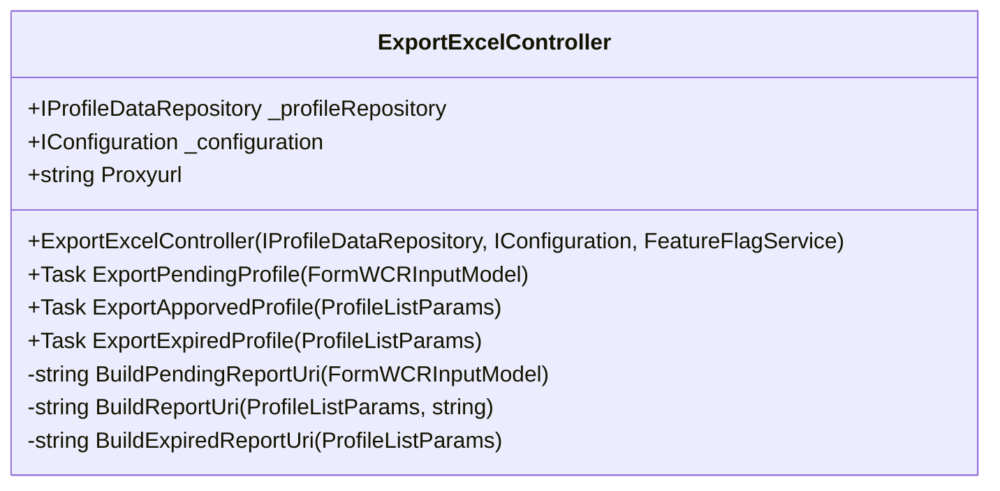

# ExportExcelController Documentation

## Overview

The `ExportExcelController` class is part of the `COR.Profile.Api.Controllers` namespace, responsible for handling HTTP requests related to the export of profile data in Excel format. This controller uses the ASP.NET Core framework, and it is designed to interact with profile data stored in a repository. The controller allows authenticated users to export pending, approved, and expired profiles based on various filters and parameters.

### Class Diagram



## Dependencies

The `ExportExcelController` relies on several key dependencies:

- **IProfileDataRepository**: An interface for accessing profile data. It allows the controller to interact with the underlying data storage.
- **IConfiguration**: An interface for accessing configuration settings.
- **FeatureFlagService**: A service that likely manages feature toggles for the application.

## Attributes

- **_profileRepository**: An instance of `IProfileDataRepository` used to perform operations related to profile data.
- **_configuration**: An instance of `IConfiguration` used to retrieve application settings.
- **Proxyurl**: A string that stores the URL for the proxy used to access external report services.

## Constructor

```csharp
public ExportExcelController(IProfileDataRepository<ProfileModel, long> _profileRepositoryObject, IConfiguration Configuration, FeatureFlagService featureFlagService)
```

### Parameters

- **_profileRepositoryObject**: An instance of `IProfileDataRepository<ProfileModel, long>` used to interact with profile data.
- **Configuration**: An instance of `IConfiguration` used for accessing configuration settings.
- **featureFlagService**: An instance of `FeatureFlagService` used for managing feature flags.

### Functionality

The constructor initializes the controller by setting the repository and configuration instances. It also retrieves the proxy URL from the configuration.

## Methods

### ExportPendingProfile

```csharp
[HttpPost]
[Route("ExportPendingProfile")]
public async Task<IActionResult> ExportPendingProfile([FromBody] FormWCRInputModel Params)
```

#### Description

This endpoint allows users to export pending profiles based on the provided parameters in `FormWCRInputModel`. The method constructs a report URL, retrieves the report data from an external service, and returns the URL for the generated Excel file.

#### Parameters

- **Params**: An instance of `FormWCRInputModel` containing user-defined parameters for filtering the profile data.

#### Returns

- `StatusCode(StatusCodes.Status200OK, urlpath)`: Returns the URL of the generated Excel report.

### BuildPendingReportUri

```csharp
[NonAction]
private string BuildPendingReportUri(FormWCRInputModel Params)
```

#### Description

Constructs the URI for the pending report based on the parameters provided in `FormWCRInputModel`. This method ensures that null values are replaced with empty strings to prevent issues in the URI format.

#### Parameters

- **Params**: An instance of `FormWCRInputModel` containing filtering parameters.

#### Returns

- `string`: The formatted URI for the pending report.

### ExportApporvedProfile

```csharp
[HttpPost]
[Route("ExportApporvedProfile")]
public async Task<IActionResult> ExportApporvedProfile([FromBody] ProfileListParams Param)
```

#### Description

This endpoint allows users to export approved profiles based on the parameters defined in `ProfileListParams`. Similar to `ExportPendingProfile`, it constructs a report URL and retrieves the report data.

#### Parameters

- **Param**: An instance of `ProfileListParams` containing user-defined parameters.

#### Returns

- `StatusCode(StatusCodes.Status200OK, urlpath)`: Returns the URL of the generated Excel report.

### ExportExpiredProfile

```csharp
[HttpPost]
[Route("ExportExpiredProfile")]
public async Task<IActionResult> ExportExpiredProfile([FromBody] ProfileListParams Param)
```

#### Description

This endpoint allows users to export expired profiles based on the provided parameters in `ProfileListParams`. It constructs the report URL similar to the previous methods.

#### Parameters

- **Param**: An instance of `ProfileListParams` containing user-defined parameters.

#### Returns

- `StatusCode(StatusCodes.Status200OK, urlpath)`: Returns the URL of the generated Excel report.

### BuildReportUri

```csharp
[NonAction]
private string BuildReportUri(ProfileListParams param, string report)
```

#### Description

Constructs the URI for generating reports based on the provided parameters and the specific report type (e.g., approved or expired). This method ensures that null values are handled appropriately.

#### Parameters

- **param**: An instance of `ProfileListParams` containing filtering parameters.
- **report**: A string indicating the type of report being requested.

#### Returns

- `string`: The formatted URI for the specified report.

### BuildExpiredReportUri

```csharp
[NonAction]
private string BuildExpiredReportUri(ProfileListParams param)
```

#### Description

Constructs the URI for the expired profiles report by delegating to `BuildReportUri` with the appropriate report type.

#### Parameters

- **param**: An instance of `ProfileListParams`.

#### Returns

- `string`: The formatted URI for the expired profiles report.

## Conclusion

The `ExportExcelController` is responsible for facilitating the export of profile data into Excel format based on various user-defined parameters. It utilizes an external reporting service to generate the reports and provides endpoints for pending, approved, and expired profiles. The controller is designed to be secure, requiring authentication for access, and it incorporates rate limiting to manage request load effectively.