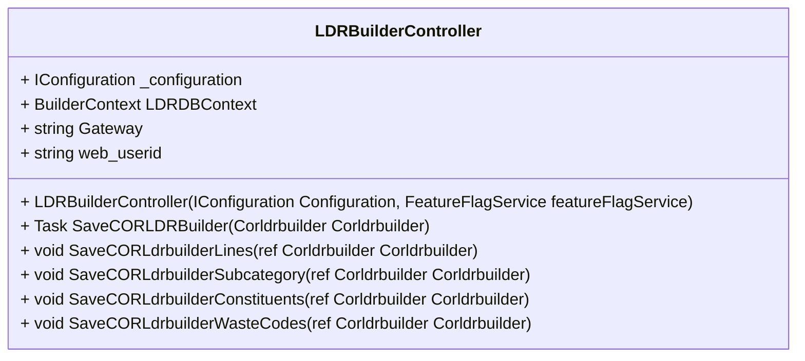

# LDRBuilderController Documentation

## Overview

The `LDRBuilderController` class is an ASP.NET Core API controller that handles operations related to the "LDR Builder" functionality. It includes methods for saving data related to the LDR Builder, including its lines, subcategories, constituents, and waste codes. The class utilizes Entity Framework Core for data persistence and follows RESTful principles for API design.

## Class Hierarchy



## Attributes

- **_configuration**: An instance of `IConfiguration` that holds application settings, primarily used to retrieve the configuration of the gateway.
- **LDRDBContext**: An instance of `BuilderContext`, which represents the database context for the LDR Builder data model.
- **Gateway**: A string variable that stores the gateway URL from the configuration.
- **web_userid**: A string variable for holding the user ID of the currently authenticated user (although it is not utilized in the provided code).

## Constructor

```csharp
public LDRBuilderController(IConfiguration Configuration, FeatureFlagService featureFlagService) : base(featureFlagService)
```

### Parameters

- **Configuration**: An instance of `IConfiguration` that provides access to application configuration settings.
- **featureFlagService**: An instance of `FeatureFlagService` used for managing feature flags.

### Functionality

- Initializes the `_configuration` and `LDRDBContext` attributes.
- Retrieves the value of the "Gateway" configuration setting.

## Methods

### SaveCORLDRBuilder

```csharp
[HttpPost]
[Route("LDRBuilderSave")]
public async Task<object> SaveCORLDRBuilder(Corldrbuilder Corldrbuilder)
```

#### Parameters

- **Corldrbuilder**: An object of type `Corldrbuilder`, which contains the data to be saved.

#### Returns

- Returns an `object` that indicates the result of the save operation, either a success status code with the LDR Builder ID or a bad request status with error messages.

#### Functionality

1. Retrieves the currently authenticated user ID using the `GetUser()` method.
2. Checks if the model state is valid.
3. Sets the creation and modification metadata (user ID and timestamp).
4. Calls private methods to populate associated entities (lines, subcategories, constituents, and waste codes).
5. Saves the `Corldrbuilder` instance to the database and returns the appropriate response.

### SaveCORLdrbuilderLines

```csharp
private void SaveCORLdrbuilderLines(ref Corldrbuilder Corldrbuilder)
```

#### Parameters

- **Corldrbuilder**: A reference to the `Corldrbuilder` object that is being processed.

#### Functionality

- Iterates through the `CorldrbuilderLines` collection and sets the created and modified metadata for each line.

### SaveCORLdrbuilderSubcategory

```csharp
private void SaveCORLdrbuilderSubcategory(ref Corldrbuilder Corldrbuilder)
```

#### Parameters

- **Corldrbuilder**: A reference to the `Corldrbuilder` object that is being processed.

#### Functionality

- Iterates through the `CorldrbuilderLines` collection and for each line, it iterates through the associated `CorldrbuilderSubcategory` collection, setting the created and modified metadata.

### SaveCORLdrbuilderConstituents

```csharp
private void SaveCORLdrbuilderConstituents(ref Corldrbuilder Corldrbuilder)
```

#### Parameters

- **Corldrbuilder**: A reference to the `Corldrbuilder` object that is being processed.

#### Functionality

- Iterates through the `CorldrbuilderLines` collection and for each line, it iterates through the associated `CorldrbuilderConstituents` collection, setting the created and modified metadata.

### SaveCORLdrbuilderWasteCodes

```csharp
private void SaveCORLdrbuilderWasteCodes(ref Corldrbuilder Corldrbuilder)
```

#### Parameters

- **Corldrbuilder**: A reference to the `Corldrbuilder` object that is being processed.

#### Functionality

- Iterates through the `CorldrbuilderLines` collection and for each line, it iterates through the associated `CorldrbuilderWasteCode` collection, setting the created and modified metadata.

## Error Handling

The `SaveCORLDRBuilder` method contains a try-catch block to handle exceptions. If an exception occurs, it throws a new exception with the message from the caught exception.

## Rate Limiting and Authorization

The controller is decorated with attributes that enforce rate limiting (`EnableRateLimiting("fixed")`) and require authorization (`[Authorize]`). This ensures that only authenticated users can access the endpoints and that the API is protected against excessive requests.

## Conclusion

The `LDRBuilderController` provides a robust implementation for handling LDR Builder objects within an ASP.NET Core application. It effectively interacts with the database context to save structured data while maintaining metadata for auditing purposes. The use of private methods helps to modularize the code for clarity and maintainability.